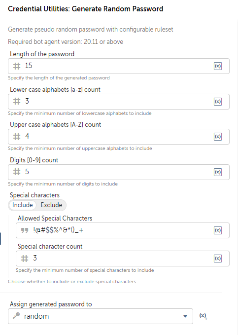
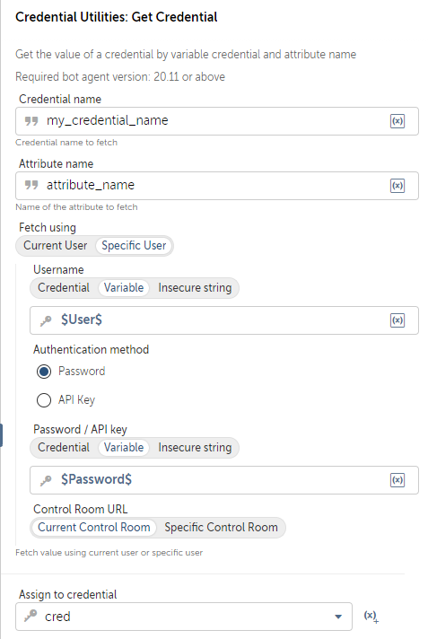
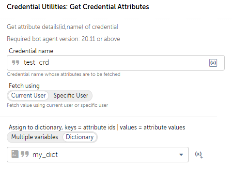

# Credential Utilities Package

This package provides a set of utility functions to enhance the management of credentials in Automation Anywhere. It allows you to generate random passwords with specific rules, retrieve credentials dynamically, list credential attributes, and update credential values. With this package, you can automate the generation and management of credentials, making your bots more robust and secure.

## Summary

| Feature                        | Existing Packages| Credential Utilities Package |
|--------------------------------|----------|-----------------------------|
| Generate Secure Passwords      |   ❌    |   ✔️                        |
| Dynamic Credential Retrieval   |   ❌    |   ✔️                        |
| List Credential Attributes     |   ❌    |   ✔️                        |
| Update Credential Values       |   ❌    |   ✔️                        |

## Building the Project

You can build this project using Gradle with the following command:

```bash
gradle clean build :shadowJar
```

## Important Note for Community Edition Control Room Users
- **Warning**: Please be aware that in the Community Edition Control Room, the system does not automatically set the latest version of imported packages as the default. To ensure you are using the latest and fully functional features, you must manually change the package version to the latest version in every bot.

## About

This project addresses challenges in credential automation within the Automation Anywhere ecosystem:

1. **Generate Secure Passwords**: It enables you to generate psuedo random credential variables following specific ruleset of desired application, ensuring the security of your credentials.
</br> 

2. **Dynamic Credential Retrieval**: You can retrieve credentials at runtime, allowing you to decide which credential and attribute to use during bot execution, rather than selecting them during development.
</br> 

3. **List Credential Attributes**: The package provides the ability to list all available credential attributes dynamically, making your bots more versatile.
</br> 

4. **Update Credential Values**: With this package, you can update credential values, a functionality not possible through standard Automation Anywhere packages.
</br> 


