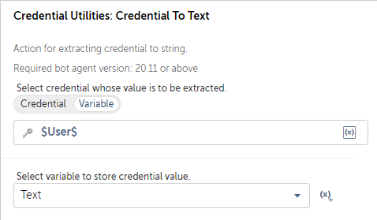

### Credential To Text

- **Description:** Retrieves a secure credential and returns it as a string value.

### Parameters

1. `credentials` (Type: `SecureString`)
    - **Description:** The secure credential to retrieve.
    - **Constraints:**
    - Must not be empty.
    - Must be a valid credential.
    - Must be of type `SecureString`.

- **Return Type:** `String`

- **Exceptions:**
    - Throws a `BotCommandException` if there are errors while fetching the credential.