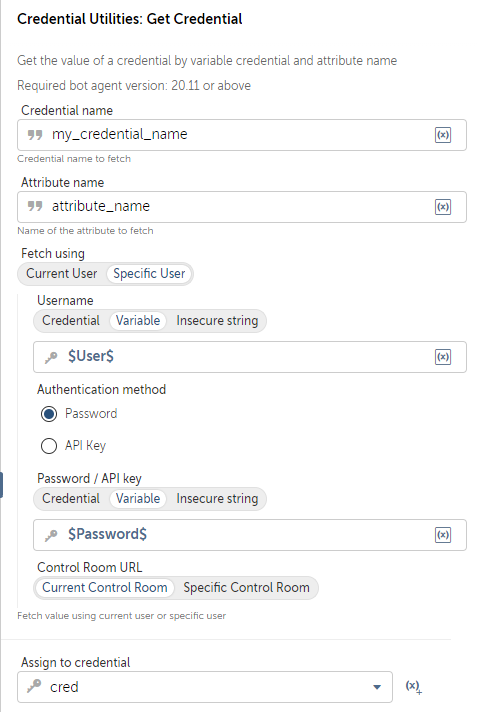

# Get Credential
## Required: Either credential owner or "View and edit ALL credentials attributes value" permission role
- **Description:** Retrieves a secure credential attribute based on the provided parameters and authentication settings.

### Parameters

1. `credentialName` (Type: `String`)
    - **Label:** Credential Name
    - **Description:** The name of the credential.
    - **Constraints:**
        - Must not be empty.

2. `attributeName` (Type: `String`)
    - **Label:** Attribute Name
    - **Description:** The name of the attribute to retrieve.
    - **Constraints:**
        - Must not be empty.

3. `authType` (Type: `String`)
    - **Label:** Authentication Type
    - **Description:** The authentication type.
    - **Default Value:** "user"
    - **Options:**
        - Current User: Use current user credentials.
        - Specific User: Authenticate with specific credentials.
    - **Constraints:**
        - Must not be empty.

    - If `authType` is "authenticate" (Specific User), the following parameters become mandatory:

      3.1. `username` (Type: `SecureString`)
        - **Label:** Username
        - **Constraints:**
        - Must not be empty.

      3.2. `authMethod` (Type: `String`)
        - **Label:** Authentication Method
        - **Default Value:** "password"
        - **Options:**
        - Password: Authenticate using a password.
        - API Key: Authenticate using an API key.
        - **Constraints:**
        - Must not be empty.

      3.3. `authDetails` (Type: `SecureString`)
        - **Label:** Authentication Details
        - **Constraints:**
        - Must not be empty.

      3.4. `CRType` (Type: `String`)
        - **Label:** Change Request Type
        - **Default Value:** "current"
        - **Options:**
        - Current CR: Use the current change request.
        - Specific CR: Use a specific change request.
        - **Constraints:**
        - Must not be empty.

        - If `CRType` is "specific" (Specific CR), the following parameter becomes mandatory:

          3.4.1. `specificCRURL` (Type: `SecureString`)
            - **Label:** Specific CR URL
            - **Constraints:**
            - Must not be empty.

- **Return Type:** `SecureString`

- **Exceptions:** Throws a `BotCommandException` if there are errors during attribute retrieval or processing.
