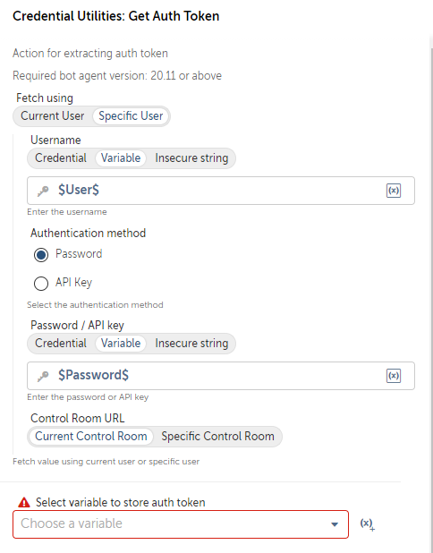

# Get Auth Token

**Description:** Retrieves an authentication token based on the provided parameters and authentication settings.

### Parameters

1. `authType` (Type: `String`)
    - **Label:** Authentication Type
    - **Description:** The authentication type.
    - **Default Value:** "user"
    - **Options:**
        - Current User: Use current user credentials.
        - Specific User: Authenticate with specific credentials.
    - **Constraints:** Must not be empty.

    - If `authType` is "authenticate" (Specific User), the following parameters become mandatory:

      1.1. `username` (Type: `SecureString`)
        - **Label:** Username
        - **Description:** The username for authentication.
        - **Constraints:** Must not be empty.

      1.2. `authMethod` (Type: `String`)
        - **Label:** Authentication Method
        - **Description:** The authentication method.
        - **Default Value:** "password"
        - **Options:**
        - Password: Authenticate using a password.
        - API Key: Authenticate using an API key.
        - **Constraints:** Must not be empty.

      1.3. `authDetails` (Type: `SecureString`)
        - **Label:** Authentication Details
        - **Description:** The authentication details (password or API key) for authentication.
        - **Constraints:** Must not be empty.

      1.4. `CRType` (Type: `String`)
        - **Label:** Control Room Type
        - **Description:** The Control Room type.
        - **Default Value:** "current"
        - **Options:**
        - Current CR: Use the current Control Room.
        - Specific CR: Use a specific Control Room.
        - **Constraints:** Must not be empty.

        - If `CRType` is "specific" (Specific CR), the following parameter becomes mandatory:

          1.4.1. `specificCRURL` (Type: `SecureString`)
            - **Label:** Specific CR URL
            - **Description:** The URL of the specific Control Room.
            - **Constraints:** Must not be empty.

2. `authVersion` (Type: `String`)
    - **Label:** Authentication Version
    - **Description:** The version of the authentication endpoint to use.
    - **Default Value:** "v2"
    - **Options:**
        - v1: Use version 1 of the authentication endpoint.
        - v2: Use version 2 of the authentication endpoint.
    - **Constraints:** Must not be empty.

### Return Type

- `Credential`: The authentication token.

### Exceptions

Throws a `BotCommandException` if there are errors during token retrieval or processing.